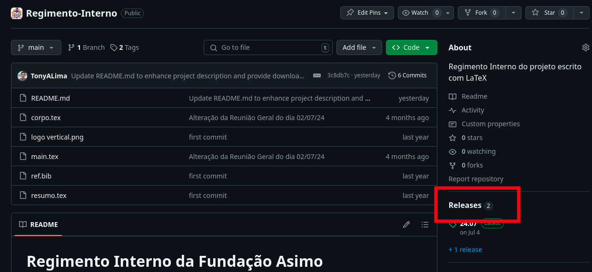

# Como criar uma versão de lançamento no GitHub

## Nomenclatura

As versões do Regimento Interno são nomeadas com o padrão AA.MM, ou seja o ano e o mês de aprovação da versão.

exemplo: a versão aprovada em setembro de 2023 é a versão 23.09

## Passo 1: Criar uma tag no Git

1. Certifique-se de que todas as mudanças desejadas estão commitadas.
2. Crie uma nova tag com o comando:
    ```sh
    git tag -a AA.MM -m "MENSAGEM"
    ```
    Ex:
    ```sh
    git tag -a 23.09 -m "Versão aprovada em 02/09/2023 por votação em reunião geral."
    ```
    Mais informações sobre tags podem ser encontradas em [Git Basics - Tagging](https://git-scm.com/book/en/v2/Git-Basics-Tagging).

## Passo 2: Criar versão no GitHub

1. Push a tag para o Github.
    ```sh
    git push origin AA.MM
    ```

2. Com o repositório aberto em um navegador, clique em *Releases* no lado direito da página.


3. Clique em *Draft a new release*.


4. Em *Choose a tag* selecione a tag que você acabou de criar no passo anterior.


5. Na seção de texto escreva uma mensagem descritiva, como a usada para criar a tag.

6. Na seção de arquivos binários em baixo insira o regimento interno em pdf com o nome "Regimento_Interno_AA_MM.pdf" e o arquivo com as mudanças destacadas com o nome "Mudancas_Regimento_Interno_AA_MM.pdf".
7. Marque a opção *Set as the latest release*.

8. Clique em *Upload release*.

## Passo 3: Atualize o README

O arquivo README.md contém links de download para os pdfs do regimento que devem sempre apontar para a versão mais recente, então atualize estes links para os novos arquivos.

Se você utilizou o padrão de nomes sugerido acima será somente trocar o numero da versão dentro dos links.

Não se esqueça de atualizar tanto o "Última versão" quanto o "Mudanças recentes" e testar se o download funciona antes de commitar a atualização.

---

Pronto você criou e publicou uma atualização do regimento interno do nosso projeto.
